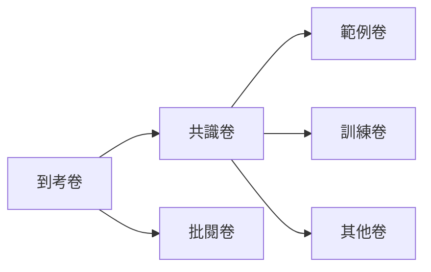

### 登入
#### 傳送帳號密碼
```json
{
  "username":"101",
  "password":"abcd1234"
}
```
#### 核對後取得token通行證
```sql
SELECT
  UserPwd,
  UserName,
  UserType --委員類別,提供標準會議與正式批改區分使用
FROM UserBase
WHERE UserNo = @username
```

### 左側導覽列資訊

#### 取得閱卷資訊
```json
{
    "種類": "共識卷/範例卷/訓練卷/批閱卷",
    "閱卷資料": {
        "5000010": [
            [
                "G101",
                {
                    "總題數": 50,
                    "已改": 50,
                    "是否鎖定": true
                }
            ],
            [
                "G102",
                {
                    "總題數": 50,
                    "已改": 50,
                    "是否鎖定": true
                }
            ],
            [
                "..."
            ]
        ],
      "51000100": [
            [
                "H101",
                {}
            ],
            [
                "..."
            ]
        ]
    }
}
```
:arrow_right: 取得api是要一次取得 題組資訊、卷包資訊、試卷資訊, 還是分次取得 😕?


#### 取得題組及卷包總數
```sql
SELECT
	CPaperQunID AS '題組', 
	StudCode1 AS '卷包編號',  
	PaperQunID AS '子題序',
	SUM(CASE WHEN ReadFlag = '0' THEN 1 ELSE 0 END) AS '未閱',
	SUM(CASE WHEN ReadFlag = '1' THEN 1 ELSE 0 END) AS '已閱',
	SUM(CASE WHEN ReadFlag = '2' THEN 1 ELSE 0 END) AS '已鎖',
	COUNT(*) AS '總量'
FROM zScoreRecNum_ + @UserNo --個人列表
GROUP BY StudCode1, CPaperQunID, PaperQunID, ReadFlag
ORDER BY StudCode, PaperQunID
```
> ReadFlag: 0未改 1改完 2鎖定

### 上下一頁
按上下一頁觸發:
1. 檢查是否完成 (前後端個別驗一次 😕?)
2. 送出成績到個表
3. 取得下一份資料

不同觸發情境:
1. 共識卷 > 認定一位老師為標準
2. 範例卷 > 大家可以看,但已鎖定/有分數/不能改動
3. 訓練卷 > 大家看到同一包
4. 批閱卷 

#### 送出資料
```json
{
    "StudNo": "試卷編號 -> 有准考證資訊或是用其他編碼?",
    "NextNo": "下一份的編碼",
    "Scores": {
        "G101": {
            "1": 3.5,
            "2": 10.0,
            "3": 0.0,
            "...":0.0
        }
    },
    "CheckCode": "零分編碼",
    "CheckText": "零分理由(如果「其他」有內容)",
    "VioCode": "違規編碼",
    "VioText": "違規原因(只有「其他」會有內容)",
    "examServerRatio": 1.8915254237288135,
    "examFrameSize": [
        [
            0,
            0
        ],
        [
            1180,
            1271.989247311828
        ]
    ],
    "correctionDrawing": [
        "d3Jk8AEACAASEAAAAAAAAAAAAAAAAAAAAAASEM9W8X340UP1qe7ckQHRVO0aBggAEAAYABoGCA0QARgNIisKFA0AAIA\/FQAAAA ...",
        "d3Jk8AEACAA6DggAEP\/\/\/\/\/\/\/\/\/\/fxgAQhBN8PWiWj1Da5+zjPz4D87T"
    ],
    "checkUIView": [
        {
            "checkItem": [],
            "positionPage": 1
        },
        {
            "checkItem": [],
            "positionPage": 2
        }
    ],
    "violationDrawing": [
        "d3Jk8AEACAA6DggAEP\/\/\/\/\/\/\/\/\/\/fxgAQhCUb7bq5q5CXLJ2HlI+UXEa",
        "d3Jk8AEACAA6DggAEP\/\/\/\/\/\/\/\/\/\/fxgAQhCUb7bq5q5CXLJ2HlI+UXEa"
    ]
}
```
:arrow_right: Scores分數的部分, 可以考慮組合 StudNo試卷編號、QunNo題號、StudCode1卷包編號、RaterID試卷序

#### 取得該「卷包」試卷批改資訊
圖檔同時呈現AB面, 底圖是`jpg`, 由api回傳json後產生批閱劃記`png`
```sql
SELECT 
	StudNo AS 試卷編號,
	Score AS 分數,
	yaxis AS Y軸,
	ImgPathFull AS 圖檔路徑,
	CheckCode AS 零分編碼,
	CheckText AS 零分原因,
	VioCode AS 違規編碼,
	VioText AS 違規原因,
	ReadFlag AS 批改狀態
FROM zScoreRecNum_+@UserNo
WHERE StudCode1 = 'G101'
ORDER BY RaterID
```

### 鎖定
分兩種:
1. 改到最後一份時跳出提示
2. 回到導覽頁面按下鎖定鍵
都需要先檢查是否完成

#### 送出資料 x 50 

```json
```
➡️是否需要再送一次base64的畫筆痕跡 😕?

#### 一次更新50筆左右的資料
```sql
UPDATE ScoreRec
SET 
	Score1 = ScoreTmp.Score,
	CheckCode1 = ScoreTmp.CheckCode,
	CheckText1 = ScoreTmp.CheckText,
	VioCode1 = ScoreTmp.VioCode,
	VioText1 = ScoreTmp.VioText
	-- ...
FROM ScoreRec
INNER JOIN zScoreRecNum_+@UserNo AS ScoreTmp 
ON 
	ScoreRec.StudNo = ScoreTmp.StudNo AND 
	ScoreRec.StudCode1 = ScoreTmp.StudCode1 AND 
	ScoreRec.QunNo = ScoreTmp.QunNo;
```
➡️預設派卷時已經都展開,僅更新資料,如何寫 😕?

## 預備區

### 最新公告
```json
```
```sql
```



### 標準會議
透過 `參數ExamNo` 或 `另一張表` 區分標準會議、訓練會議、正式批閱
```json
```
```sql
```

### 共識卷
```json
```
```sql
```

### 範例卷
```json
```
```sql
```

### 訓練卷
```json
```
```sql
```

### 批閱卷
```json
```
```sql
```
